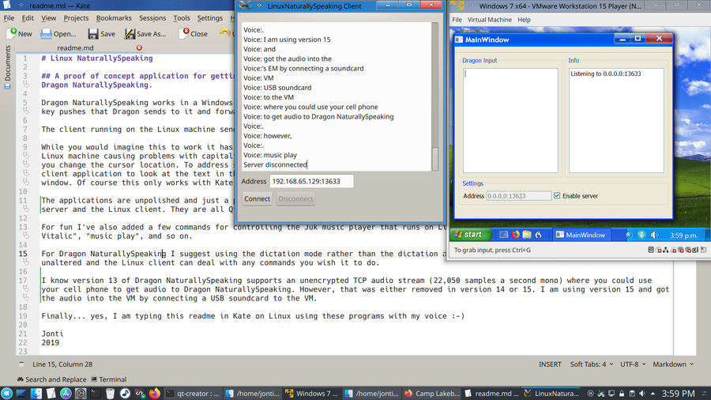

# Linux NaturallySpeaking

## A proof of concept application for getting continuous voice recognition for dictation purposes working on native Linux applications using Dragon NaturallySpeaking.

Dragon NaturallySpeaking works in a Windows VM running inside a Linux machine. A server program running on the same Windows machine takes the key pushes that Dragon sends to it and forwards them to a client running on the Linux machine via an encrypted TCP channel.

The client running on the Linux machine sends the receive text to the currently focused window.

While you would imagine this to work it has problems. Dragon NaturallySpeaking running on Windows has no idea when you change text on the Linux machine causing problems with capitalization and spaces. Dragon also doesn't know the context of words is again it doesn't know when you change the cursor location. To address some of these issues I made a plugin for Kate (a text editor for Linux) that allows the Linux client application to look at the text in the Kate application; it's not perfect but it's a step up from simply sending the text to the focus window. Of course this only works with Kate as this is the only program I have written a plugin for the Linux client.

The applications are unpolished and just a proof of concept. You will see three folders in this directory; the Kate plugin, the Windows server and the Linux client. They are all Qt projects, have a look at the readme in each of the folders.

For fun I've also added a few commands for controlling the Juk music player that runs on Linux. So you can say things like, "music search Vitalic", "music play", and so on.

For Dragon NaturallySpeaking I suggest using the dictation mode rather than the dictation and commands mode so the text is passed through unaltered and the Linux client can deal with any commands you wish it to do.

I know version 13 of Dragon NaturallySpeaking supports an unencrypted TCP audio stream (22,050 samples a second mono) where you could use your cell phone to get audio to Dragon NaturallySpeaking. However, that was either removed in version 14 or 15. I am using version 15 and got the audio into the VM by connecting a USB soundcard to the VM.

Finally... yes, I am typing this readme in Kate on Linux using these programs with my voice :-)

Jonti
2019

